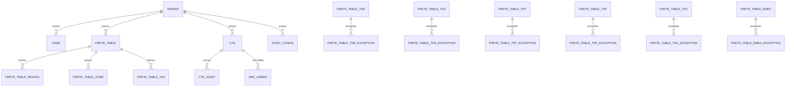
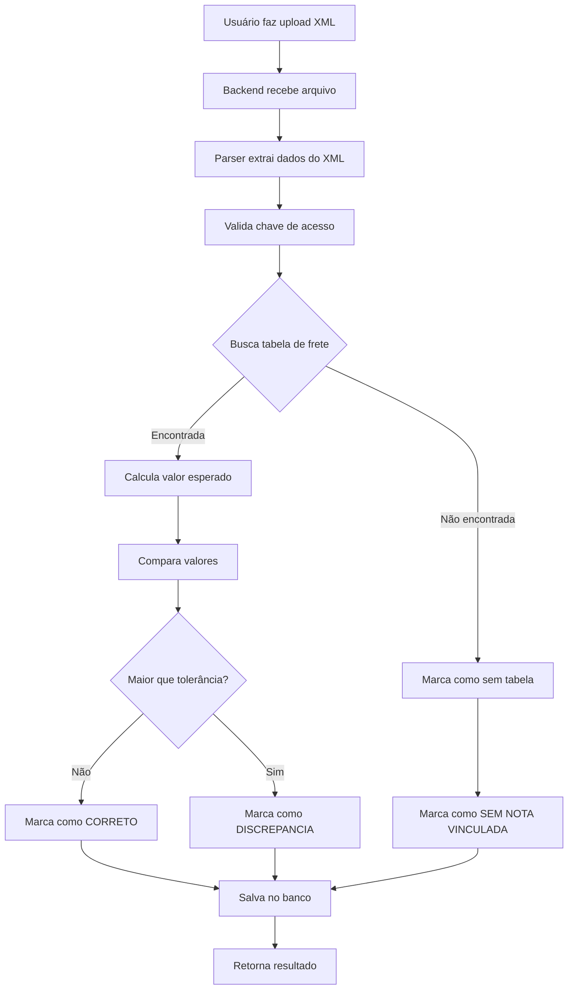
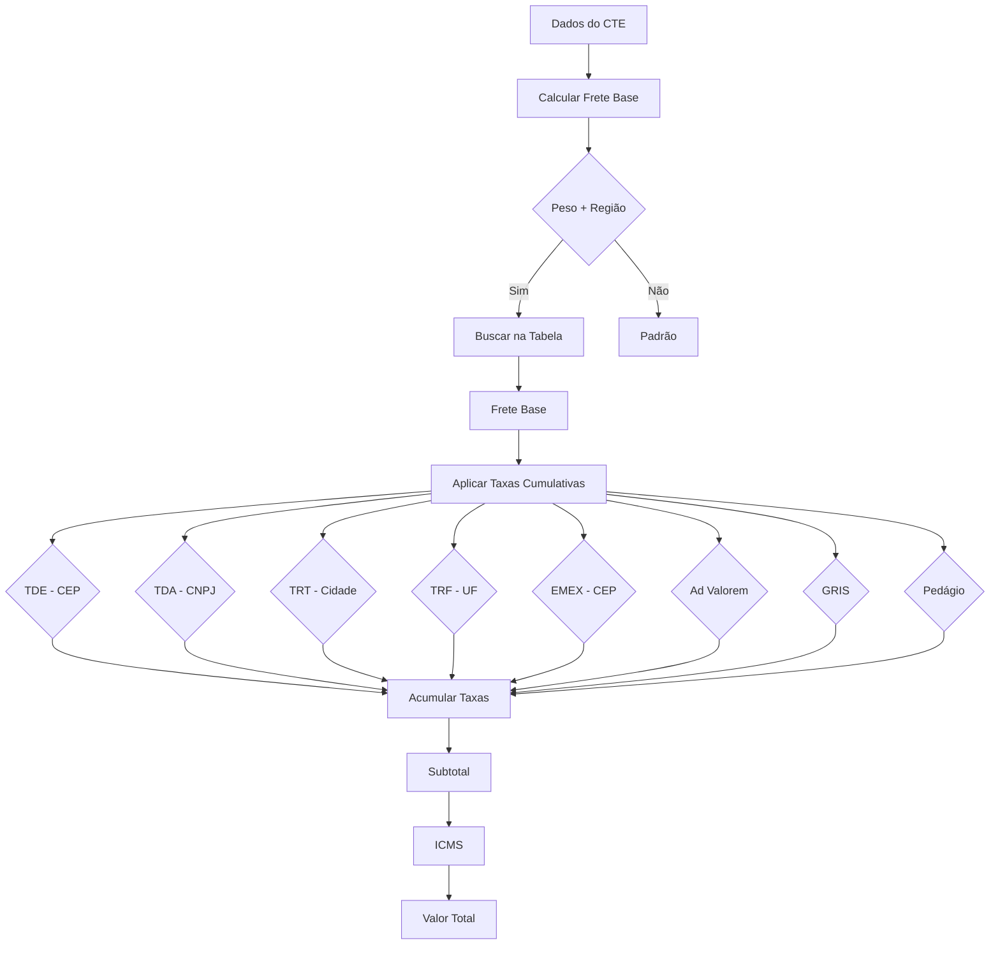

# Plano de Arquitetura - Sistema TMS (Auditor de Frete)

## Visão Geral do Sistema

Sistema web para auditoria de fretes através de importação de XML de CT-e (Conhecimento de Transporte Eletrônico). O sistema analisa os valores cobrados pelas transportadoras comparando-os com tabelas de frete cadastradas, identificando discrepâncias e automatizando a aprovação.

## Stack Tecnológico

| Camada | Tecnologia |
|--------|------------|
| Frontend | Next.js 14 (App Router) + TypeScript |
| UI Components | shadcn/ui + Tailwind CSS |
| Backend | Node.js + Express |
| ORM | Prisma |
| Banco de Dados | PostgreSQL |
| Autenticação | JWT (JSON Web Tokens) |
| Parser XML | fast-xml-parser |

---

## 1. Arquitetura de Banco de Dados

### Estrutura de Diretórios do Projeto

```
/workspaces/Veltra_tms
├── backend/
│   ├── src/
│   │   ├── config/           # Configurações
│   │   ├── controllers/      # Controllers
│   │   ├── middleware/       # Middlewares (auth, validation)
│   │   ├── routes/            # Rotas API
│   │   ├── services/         # Lógica de negócio
│   │   ├── models/            # Models Prisma
│   │   ├── parsers/          # Parsers XML
│   │   ├── freight-engine/   # Motor de Cálculo de Frete
│   │   │   ├── index.ts
│   │   │   ├── types.ts
│   │   │   ├── calcular-frete.ts
│   │   │   └── converter.ts
│   │   └── utils/            # Utilitários
│   ├── prisma/
│   │   ├── schema.prisma     # Schema do banco
│   │   └── migrations/
│   ├── package.json
│   └── tsconfig.json
│
├── frontend/
│   ├── src/
│   │   ├── app/               # Next.js App Router
│   │   ├── components/        # Componentes React
│   │   ├── hooks/            # Hooks customizados
│   │   ├── lib/              # Libraries
│   │   ├── services/         # Chamadas API
│   │   ├── stores/           # Estado (Zustand/Context)
│   │   └── types/            # Tipos TypeScript
│   ├── package.json
│   └── tailwind.config.ts
│
└── plans/
    └── tms-freight-auditor-plan.md
```

### Schema Principal



### Tabelas do Banco

#### 1. `tenants` - Empresas/Tenants
| Coluna | Tipo | Descrição |
|--------|------|-----------|
| id | UUID | PK |
| name | VARCHAR(255) | Nome da empresa |
| cnpj_root | VARCHAR(8) | CNPJ raiz (8 dígitos) |
| created_at | TIMESTAMP | Data criação |
| updated_at | TIMESTAMP | Data atualização |

#### 2. `users` - Usuários
| Coluna | Tipo | Descrição |
|--------|------|-----------|
| id | UUID | PK |
| tenant_id | UUID | FK → tenants |
| name | VARCHAR(255) | Nome completo |
| email | VARCHAR(255) | Email único por tenant |
| password_hash | VARCHAR(255) | Senha hasheada |
| role | ENUM('admin', 'manager', 'auditor') | Cargo |
| created_at | TIMESTAMP | Data criação |

#### 3. `ctes` - CT-e Importados
| Coluna | Tipo | Descrição |
|--------|------|-----------|
| id | UUID | PK |
| tenant_id | UUID | FK → tenants |
| chave_acesso | VARCHAR(44) | Chave única do CT-e |
| xml_original | TEXT | XML completo |
| valor_total_servico | DECIMAL(15,2) | vTPrest |
| valor_frete_peso | DECIMAL(15,2) | Frete peso |
| valor_receber | DECIMAL(15,2) | vRec |
| componentes_detalhados | JSONB | Taxas (GRIS, PEDAGIO, etc) |
| data_emissao | TIMESTAMPTZ | Data emissão |
| data_programada | DATE | Data entrega programada |
| valor_mercadoria | DECIMAL(15,2) | Valor notas fiscais |
| peso_real | DECIMAL(15,4) | Peso em KG |
| emitente_cnpj | VARCHAR(14) | CNPJ emitente |
| emitente_nome | VARCHAR(255) | Nome emitente |
| tomador_cnpj | VARCHAR(14) | CNPJ tomador |
| tomador_cidade | VARCHAR(255) | Cidade tomador |
| tomador_uf | VARCHAR(2) | UF tomador |
| tomador_cep | VARCHAR(9) | CEP tomador |
| status | ENUM | Status (pendente, conferido, discrepancia, correto, liberado) |
| audit_id | UUID | FK → cte_audits |
| created_at | TIMESTAMP | Data importação |

#### 4. `cte_audits` - Auditorias dos CT-e
| Coluna | Tipo | Descrição |
|--------|------|-----------|
| id | UUID | PK |
| cte_id | UUID | FK → ctes |
| auditor_id | UUID | FK → users |
| valor_apurado | DECIMAL(15,2) | Valor calculado pela tabela |
| diferenca_valor | DECIMAL(15,2) | Diferença encontrada |
| diferenca_percent | DECIMAL(5,2) | % diferença |
| status | ENUM | Status auditoria |
| justificativa | TEXT | Justificativa se liberado |
| tolerancia_usada | BOOLEAN | Se usou tolerância |
| created_at | TIMESTAMP | Data auditoria |

#### 5. `frete_tables` - Tabelas de Frete
| Coluna | Tipo | Descrição |
|--------|------|-----------|
| id | UUID | PK |
| tenant_id | UUID | FK → tenants |
| name | VARCHAR(255) | Nome da tabela |
| transportadora_nome | VARCHAR(255) | Nome transportadora |
| transportadora_cnpj_root | VARCHAR(8) | CNPJ raiz transportadora |
| ativa | BOOLEAN | Se está ativa |
| tipo_tabela | ENUM('unica', 'por_peso', 'por_valor') | Tipo tabela |
| created_at | TIMESTAMP | Data criação |

#### 6. `frete_table_pricing` - Preços Frete Peso (Tabela Única)
| Coluna | Tipo | Descrição |
|--------|------|-----------|
| id | UUID | PK |
| freight_table_id | UUID | FK → freight_tables |
| ate_kg | DECIMAL(15,2) | Até peso (kg) |
| valor | DECIMAL(15,2) | Valor em R$ |

#### 7. `frete_table_taxes` - Taxas Fixas/Percentuais
| Coluna | Tipo | Descrição |
|--------|------|-----------|
| id | UUID | PK |
| freight_table_id | UUID | FK → freight_tables |
| taxa_nome | VARCHAR(50) | Nome da taxa |
| tipo | ENUM('percentual', 'fixo') | Tipo |
| valor | DECIMAL(15,4) | Valor |
| ativo | BOOLEAN | Se ativo |

#### 8. `frete_table_regions` - Regiões de Prazo
| Coluna | Tipo | Descrição |
|--------|------|-----------|
| id | UUID | PK |
| freight_table_id | UUID | FK → freight_tables |
| regiao | VARCHAR(100) | Nome região |
| prazo_dias | INTEGER | Prazo em dias |

#### 9. `frete_table_exceptions` - Exceções por Tipo (TDE, TDA, TRT, etc)
| Coluna | Tipo | Descrição |
|--------|------|-----------|
| id | UUID | PK |
| freight_table_id | UUID | FK → freight_tables |
| tipo_excecao | ENUM('TDE','TDA','TRT','TRF','TDC','EMEX') | Tipo |
| tipo_cadastro | ENUM('cep', 'cnpj', 'cidade') | Tipo referência |
| referencia_inicio | VARCHAR(9) | CEP/CNPJ inicial |
| referencia_fim | VARCHAR(9) | CEP/CNPJ final |
| cidade | VARCHAR(255) | Cidade (se aplicável) |
| uf | VARCHAR(2) | UF (se aplicável) |
| regiao | VARCHAR(100) | Região (se aplicável) |
| valor | DECIMAL(15,2) | Valor |
| percentual | DECIMAL(5,2) | Percentual |
| valor_minimo | DECIMAL(15,2) | Valor mínimo |

#### 11. `audit_configs` - Configurações de Auditoria
| Coluna | Tipo | Descrição |
|--------|------|-----------|
| id | UUID | PK |
| tenant_id | UUID | FK → tenants |
| user_id | UUID | FK → users |
| tolerancia_percent | DECIMAL(5,2) | % tolerância automática |
| tolerancia_fixo | DECIMAL(15,2) | Valor fixo tolerância |
| valor_limite_auditoria | DECIMAL(15,2) | Limite para auto-audit |
| pode_aprovar_discrepancia | BOOLEAN | Se pode aprovar com diferença |
| created_at | TIMESTAMP | Data criação |

#### 12. `cte_tax_items` - Itens de Taxa Normalizados
| Coluna | Tipo | Descrição |
|--------|------|-----------|
| id | UUID | PK |
| cte_id | UUID | FK → ctes |
| taxa_nome | VARCHAR(50) | Nome da taxa (ex: TDE, GRIS, PEDAGIO) |
| valor | DECIMAL(15,2) | Valor calculado |
| tipo_calculo | ENUM('percentual', 'fixo') | Tipo do cálculo |
| base_calculo | VARCHAR(20) | Base do cálculo (frete, valor_nota, etc) |
| descricao | VARCHAR(255) | Descrição da taxa |

#### 13. `import_jobs` - Jobs de Importação
| Coluna | Tipo | Descrição |
|--------|------|-----------|
| id | UUID | PK |
| tenant_id | UUID | FK → tenants |
| user_id | UUID | FK → users (responsável) |
| status | ENUM('pending', 'processing', 'completed', 'failed') | Status |
| total_files | INTEGER | Total de arquivos |
| processed_files | INTEGER | Processados |
| failed_files | INTEGER | Falhas |
| job_id | VARCHAR(255) | ID do job no BullMQ |
| created_at | TIMESTAMP | Data criação |
| completed_at | TIMESTAMP | Data conclusão |

---

## 1.1 Arquitetura de Processamento Assíncrono

### Fluxo de Importação com Fila (BullMQ)

```mermaid
flowchart TD
    A[Upload XML] --> B[POST /api/ctes/import]
    B --> C[Salva arquivo temporário]
    C --> D[Cria job na fila BullMQ]
    D --> E[Retorna 202 "Processando"]
    
    F[Worker] --> G[Processa job]
    G --> H[Parse XML]
    H --> I[Extrai dados]
    I --> J[Busca tabela de frete cache]
    J --> K[Calcula frete]
    K --> L[Salva no banco]
    L --> M[Atualiza job status]
    
    E -.-> F
    M --> N[Notifica frontend]
```

### Estratégia Híbrida de Dados

✅ **Mantém JSONB** para flexibilidade total
✅ **MAS extrai dados importantes** para relatórios rápidos

**Durante o processamento:**
1. Calcula frete → Salva JSONB completo
2. Salva itens normalizados em `cte_tax_items`

**Benefícios:**
- Relatórios rápidos (SQL direto)
- Filtros eficientes
- Não perde flexibilidade do JSONB

### Configuração do BullMQ

```typescript
// Queue configuration
const importQueue = new Queue('cte-import', {
  connection: redisConnection,
  defaultJobOptions: {
    attempts: 3,
    backoff: { type: 'exponential', delay: 1000 },
    removeOnComplete: true,
    removeOnFail: false
  }
});

// Worker configuration
const worker = new Worker('cte-import', async job => {
  await processCteFile(job.data);
}, { concurrency: 5 });
```

---

## 1.2 Sistema de Cache de Tabelas

Para performance, as tabelas de frete serão cacheadas em memória (Redis) para acesso rápido durante o processamento de CT-es.

```typescript
// Exemplo de cache de tabela
const freightTableCache = new Map<string, FreightConfig>();

async function getFreightTable(tenantId: string, cnpjRoot: string): Promise<FreightConfig> {
  const cacheKey = `${tenantId}:${cnpjRoot}`;
  
  if (freightTableCache.has(cacheKey)) {
    return freightTableCache.get(cacheKey)!;
  }
  
  // Busca no banco
  const table = await prisma.freiteTable.findFirst({
    where: {
      tenant_id: tenantId,
      transportadora_cnpj_root: cnpjRoot,
      ativa: true
    }
  });
  
  // Converte para FreightConfig
  const config = converterTableParaFreightConfig(table);
  
  // Armazena em cache (TTL: 1 hora)
  freightTableCache.set(cacheKey, config);
  
  return config;
}
```

**Estratégia de Cache:**
- **TTL:** 1 hora (ou até tabela ser atualizada)
- **Invalidação:** Ao atualizar tabela, limpar cache
- **Key:** `tenant_id:transportadora_cnpj_root`

---

## 1.3 Versionamento de Tabelas

Para garantir auditoria e controle de versões, cada tabela de frete terá um sistema de versionamento:

```typescript
// Na tabela freight_tables
interface FreightTable {
  id: UUID;
  tenant_id: UUID;
  name: string;
  transportadora_cnpj_root: string;
  versao: INTEGER;        // Número da versão
  data_inicio: DATE;      // Início de vigência
  data_fim: DATE;        // Fim de vigência (null = atual)
  ativa: BOOLEAN;
}
```

**Estratégia:**
- Ao criar nova versão, a anterior recebe `data_fim` e `ativa = false`
- CT-e importado usa a tabela vigente na data de emissão
- Histórico completo preservado para auditoria
- Migration: `versao = 1` para tablas existentes

---

## 1.4 Prioridades de Implementação

### 🔥 Prioridade 1 - Essencial (MVP)
1. Fila de processamento (BullMQ)
2. Parser de XML CT-e
3. Motor de cálculo de frete
4. CRUD básico de tabelas
5. Tela de auditoria

### 🔥 Prioridade 2 - Controle
1. Versionamento de tabela
2. Cache de tabelas
3. Normalização de taxas (cte_tax_items)

### 🔥 Prioridade 3 - Evolução
1. Assignment automático (matching CT-e → tabela)
2. Dashboard e relatórios
3. Notificações

---

## 2. Tipos TypeScript para o Motor de Cálculo

```typescript
// Tipos para o Motor de Cálculo de Frete

type TaxType = 'TDE' | 'TDA' | 'TRT' | 'TRF' | 'TDC' | 'EMEX' | 
               'ADVALOREM' | 'GRIS' | 'PEDAGIO' | 'REENTREGA' | 'DEVOLUCAO' |
               'CUBAGEM_EXCEDENTE' | 'TEVD' | 'TAXA_RDC' | 'ESTADIA' | 
               'ARMAZENAGEM' | 'ANDARES' | 'NOTURNO' | 'COMPROVANTE_ENTREGA' |
               'PROCESSO_INDENIZATORIO' | 'EMERGENCIAL';

type TaxCalculationType = 'percentual' | 'fixo';
type TaxBaseType = 'frete' | 'subtotal' | 'valor_nota' | 'total';

interface TaxCondition {
  tipo: 'cep' | 'cnpj' | 'cidade' | 'uf' | 'regiao';
  valor: string | string[] | { inicio: string; fim: string } | { inicio: string; fim: string }[];
}

interface CepRange {
  inicio: string;
  fim: string;
}

interface TaxRule {
  nome: TaxType;
  tipo_calculo: TaxCalculationType;
  valor: number;
  base_calculo?: TaxBaseType;
  condicao: TaxCondition;
  descricao?: string;
  prioridade?: number;
  ativo?: boolean;
  valor_minimo?: number;
  gris_minimo?: number;
}

interface FreightTableRow {
  regiao: string;
  ateKg: number;
  valor: number;
}

interface FreightConfig {
  fatorCubagem?: number;
  minima?: number;
  freightPeso: FreightTableRow[];
  prazoRegiao?: { regiao: string; cepDe: string; cepAte: string }[];
  taxas?: TaxRule[];
  // Taxas fixas
  taxaDespacho?: number;
  taxaSefaz?: number;
  taxaEmergencial?: number;
  taxaEmergencialTipo?: 'percentual' | 'fixo';
  // Taxas de alto impacto
  taxaReentrega?: number;
  taxaDevolucao?: number;
  taxaCubagemExcedenteTipo?: 'percentual' | 'fixo';
  taxaTevd?: number;
  taxaRdc?: number;
  // Taxas operacionais
  taxaEstadia?: number;
  taxaArmazenagem?: number;
  taxaAndares?: number;
  taxaNoturna?: number;
  taxaComprovante?: number;
  taxaProcessoIndenizatorio?: number;
  // Impostos
  pedagioPorFracao?: number;
  pedagioPesoBase?: number;
  aliquotaIcms?: number;
  //GRIS
  grisMinimo?: number;
}

interface ShipmentData {
  tipoOperacao?: 'normal' | 'complementar' | 'devolucao';
  cep: string;
  cnpj?: string;
  cidade: string;
  uf: string;
  peso: number;
  valor_nota: number;
  dimensoes?: { comprimento: number; largura: number; altura: number };
  reentrega?: boolean;
  devolucao?: boolean;
  cubagemExcedente?: number;
  tevd?: boolean;
  taxaRdc?: boolean;
  horasEstadia?: number;
  diasArmazenagem?: number;
  andares?: number;
  entregaNoturna?: boolean;
  comprovanteEntrega?: boolean;
  processoIndenizatorio?: boolean;
}

interface AppliedTax {
  nome: TaxType;
  valor: number;
  descricao?: string;
  tipo_calculo: TaxCalculationType;
  base_calculo?: TaxBaseType;
}

interface FreightCalculationResult {
  frete_base: number;
  taxas_aplicadas: AppliedTax[];
  total_taxas: number;
  valor_total_frete: number;
  peso_taxavel: number;
  regiao: string;
  pedagio: number;
  imposto?: { nome: string; valor: number; aliquota: number; base_calculo: number };
  valor_total_geral: number;
  debug?: { etapas: string[] };
}
```

interface ShipmentData {
  tipoOperacao?: 'normal' | 'complementar' | 'devolucao';
  cep: string;
  cnpj?: string;
  cidade: string;
  uf: string;
  peso: number;
  valor_nota: number;
  dimensoes?: { comprimento: number; largura: number; altura: number };
  reentrega?: boolean;
  devolucao?: boolean;
  cubagemExcedente?: number;
  tevd?: boolean;
  taxaRdc?: boolean;
  horasEstadia?: number;
  diasArmazenagem?: number;
  andares?: number;
  entregaNoturna?: boolean;
  comprovanteEntrega?: boolean;
  processoIndenizatorio?: boolean;
}

interface AppliedTax {
  nome: TaxType;
  valor: number;
  descricao?: string;
  tipo_calculo: TaxCalculationType;
  base_calculo?: TaxBaseType;
}

interface FreightCalculationResult {
  frete_base: number;
  taxas_aplicadas: AppliedTax[];
  total_taxas: number;
  valor_total_frete: number;
  peso_taxavel: number;
  regiao: string;
  pedagio: number;
  imposto?: { nome: string; valor: number; aliquota: number; base_calculo: number };
  valor_total_geral: number;
  debug?: { etapas: string[] };
}

---

## 2. Arquitetura da API (Backend)

### Endpoints Principais

#### Autenticação
```
POST   /api/auth/login          - Login
POST   /api/auth/register       - Cadastro usuário
POST   /api/auth/refresh        - Refresh token
GET    /api/auth/me             - Dados usuário atual
```

#### CT-e
```
POST   /api/ctes/import         - Importar XML(s) de CT-e
GET    /api/ctes                - Listar CT-es (com filtros)
GET    /api/ctes/:id            - Detalhar CT-e
PUT    /api/ctes/:id/audit     - Auditoriar CT-e
PUT    /api/ctes/:id/release   - Liberar CT-e com justificativa
DELETE /api/ctes/:id            - Excluir CT-e
```

#### Tabelas de Frete
```
GET    /api/freight-tables      - Listar tabelas
POST   /api/freight-tables      - Criar tabela
GET    /api/freight-tables/:id  - Detalhar tabela
PUT    /api/freight-tables/:id  - Atualizar tabela
DELETE /api/freight-tables/:id  - Excluir tabela
POST   /api/freight-tables/:id/import-excel - Importar Excel
```

#### Exceções Regionais
```
GET    /api/freight-tables/:id/exceptions          - Listar exceções
POST   /api/freight-tables/:id/exceptions          - Criar exceção
PUT    /api/freight-tables/:id/exceptions/:excId   - Atualizar exceção
DELETE /api/freight-tables/:id/exceptions/:excId   - Deletar exceção
```

#### Configurações de Auditoria
```
GET    /api/audit-config        - Ver configurações
PUT    /api/audit-config       - Atualizar configurações
```

### Fluxo de Importação de XML



### Cálculo de Frete (Motor Existente)

O sistema utilizará um **motor de cálculo de fretes** já existente que implementa as seguintes regras:



**Taxas suportadas pelo motor:**
- **Frete Peso** - Por faixa de peso e região
- **Ad Valorem** - Percentual sobre valor da nota
- **GRIS** - Percentual sobre valor da nota (com mínimo)
- **Pedágio** - Por fração de 100kg
- **TDE** - Taxa de dificuldade de entrega por CEP
- **TDA** - Taxa de dificuldade de acesso por CNPJ
- **TRT** - Taxa de restrição ao trânsito por CEP
- **TRF** - Taxa de-redespacho fluvial por CEP
- **TDC** - Taxa de dificuldade de coleta
- **EMEX** - Taxa de exceção por CEP
- **Taxas Operacionais** - Estadia, Armazenagem, Andares, Noturna, Comprovante
- **Taxas de Alto Impacto** - Reentrega, Devolução, TEVD, RDC

```
Valor Esperado = Frete Base + Taxas Cumulativas + Pedágio + ICMS
```

---

---

## 3. Arquitetura do Frontend

### Estrutura de Páginas (Next.js App Router)

```
/app
├── (auth)
│   ├── login/page.tsx
│   └── register/page.tsx
├── (dashboard)
│   ├── layout.tsx          // Sidebar + Header
│   ├── page.tsx            // Dashboard inicial
│   ├── ctes
│   │   ├── page.tsx        // Lista de CT-es + filtros
│   │   └── [id]/page.tsx   // Detalhe CT-e
│   ├── freight-tables
│   │   ├── page.tsx        // Lista de tabelas
│   │   └── [id]/page.tsx   // Editar tabela
│   ├── audit-config
│   │   └── page.tsx        // Configurações auditoria
│   └── reports
│       └── page.tsx        // Relatórios
```

### Componentes Principais

| Componente | Descrição |
|------------|-----------|
| CTEsTable | DataGrid com CT-es (filtros, paginação) |
| CTEDetailModal | Modal com detalhe do CT-e |
| FreightTableForm | Formulário de tabela defrete |
| ExceptionEditor | Editor de exceções (TDE, TDA, etc) |
| AuditResult | Resultado da auditoria (valores, diferença) |
| ToleranceConfig | Configuração de tolerâncias |

### Estado da Tela de Auditoria

```
Filtros:
├── Busca por chave/nome/cliente
├── Data emissão (início/fim)
├── Status (todos, pendente, discrepancia, correto, liberado)
└── Transportadora

Grid de CT-es:
├── Chave acesso
├── Data emissão
├── Transportadora
├── Tomador
├── Valor CT-e
├── Valor auditado
├── Diferença
├── Status
└── Ação (auditar/liberar)

Modal de Detalhe:
├── Dados XML (emitente, tomador, cidades)
├── Valores Cobrados (frete, taxas)
├── Valores Auditados (calculados)
├── Diferença (% e R$)
├── Histórico de auditorias
└── Botões: Liberar / Cancelar
```

---

## 4. Fluxo de Usuário

### Fluxo de Importação
1. Usuário acessa tela de CT-es
2. Clica em "Importar XML"
3. Seleciona um ou mais arquivos XML
4. Sistema processa e exibe resultado
5. CT-es aparecem na lista com status

### Fluxo de Auditoria
1. Usuário visualiza lista de CT-es
2. Filtra por status "Pendente" ou "Discrepância"
3. Clica em um CT-e para ver detalhes
4. Sistema mostra valores cobrados vs calculados
5. Se diferença ≤ tolerância: auto-aprovado
6. Se diferença > tolerância: precisa liberar manualmente
7. Usuário clica em "Liberar" e justifica
8. CT-e muda para status "Liberado"

### Fluxo de Gestão de Tabelas
1. Usuário acessa "Tabelas de Frete"
2. Cria nova tabela (nome, transportadora)
3. Define taxas fixas (Ad Valorem, GRIS, Pedágio)
4. Define tabela de preços (por peso)
5. Adiciona exceções por região (TDE, TDA, etc)
6. Ativa a tabela

---

## 5. Lista de Tarefas de Implementação

### Fase 1: Infraestrutura e Backend
- [ ] Configurar projeto Node.js + Express
- [ ] Configurar Prisma + PostgreSQL
- [ ] Criar schema do banco
- [ ] Implementar autenticação JWT
- [ ] Criar endpoints de login/register
- [ ] Implementar parser de XML CT-e
- [ ] Criar endpoint de importação XML
- [ ] Implementar cálculo de frete
- [ ] Criar endpoints de CT-es (CRUD)
- [ ] Criar endpoints de tabelas defrete

### Fase 2: Frontend - Autenticação
- [ ] Configurar Next.js
- [ ] Criar páginas de login/register
- [ ] Implementar context de autenticação
- [ ] Criar layout com sidebar

### Fase 3: Frontend - Telas Principais
- [ ] Implementar tela de lista de CT-es
- [ ] Implementar importação de XML
- [ ] Implementar modal de detalhe do CT-e
- [ ] Implementar tela de auditoria
- [ ] Implementar tela de tabelas defrete
- [ ] Implementar CRUD de exceções
- [ ] Implementar configuração de tolerância

### Fase 4: Funcionalidades Avançadas
- [ ] Importação de Excel para exceções
- [ ] Relatórios e dashboards
- [ ] Notificações de auditoria

---

## 6. Observações Importantes

1. **Multi-tenant**: Todos os dados devem ter `tenant_id` para isolamento
2. **JSONB**: Campo `componentes_detalhados` permite flexibilidade sem alterar schema
3. **Validação de CEP**: Formato XXXXX-XXX, CEP De < CEP Até
4. **Percentuais**: Armazenar em formato decimal (2.5 para 2,5%)
5. **Cache**: Considerar cache de tabelas defrete para performance

---

*Plano criado em: 2026-03-25*
*Versão: 1.0*